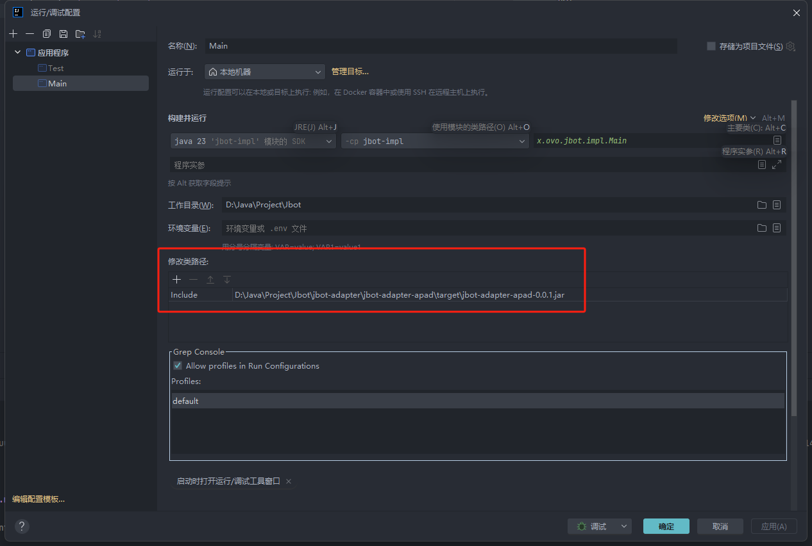

## IDEA内使用方法：

1. install `jbot-build`模块
2. install `jbot-bom`模块
3. install `jbot-core`模块
4. package `jbot-adapter-apad`
5. 将打包后的 `jbot-adapter-apad` jar包添加到启动类路径

6. 将打包后的 `jbot-js-provider` jar包添加到启动类路径(非必需,不使用js时不需要)
7. jbot-impl 模块中添加适配器依赖
```angular2html
<dependency>
    <groupId>x.ovo.jbot</groupId>
    <artifactId>jbot-adapter-gewe</artifactId>
    <version>0.0.1</version>
    <scope>compile</scope>
</dependency>
```
8. 启动 `jbot-impl` 模块中的 `main` 方法